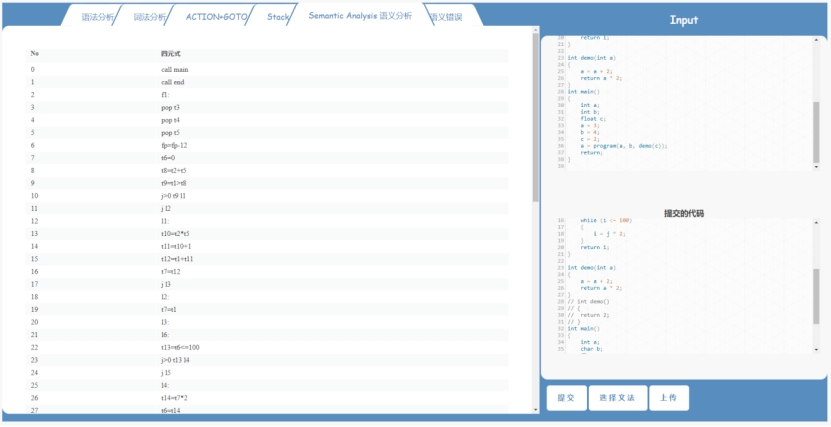
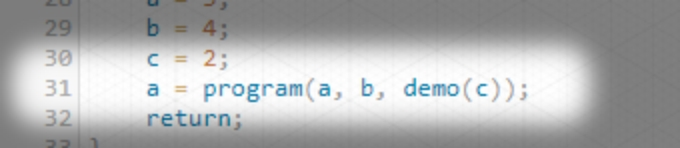

<div align="right">
  Language:
  🇺🇸
  <a title="Chinese" href="/README_CN.md">🇨🇳</a>
</div>


# 1 Requirements Analysis

## 1.1 Input and output conventions

Input: Compilation required C language program, grammar rules JSON format file.

Output: Add intermediate code table on the basis of lexical analysis table, parse tree, ACTION + GOTO table and stack process of project 1, and statically check the error list.

### 1.1.1 Source program input

Enter the C-like language program code with or without a procedure call in the text box. For examples, please refer to the following files in the submission folder:

3_ test code (example)

```|
|─── Grammar Rules
│    grammer.json
│
|─── C-like language]
|	Without procedure call.c
|	With procedure call.c
|	Example 1 - Duplicate variable definition.
|	Example 2 - Variable is undefined.
|	Example 3 - Duplicate definition of Function.c
|	Example 4 - Function is undefined.
|	Example 5 - Type error
|	Example 6 - Incorrect number of Function parameters.
|	Example 7 - The function parameter is of the wrong type.
│
└─── Please see the report for running screenshots|
```

For different types of BigInt, the fourth part of this report will giv|e simplified examples.

### 1.1.2 Semantic analysis output

L Intermediate code analysis table

### 1.1.3 Static check analysis output

L List of errors found by static inspection

## 1.2 Program Features

### 1.2.1 Semantic Analyzer

We realize the semantic analysis and intermediate code generation of C-like language with procedure call, users can test and translate any program by themselves, and view the analysis results of any project in real time.

### 1.2.2 Static semantic checking

In the process of semantic analysis, we realize the check of 7 semantic errors such as type mismatch and variable definition, give user-friendly error prompts, and realize the basic error recovery function, that is, in one check, we can achieve a complete scan of the program and find most of the errors in the program.

# 2 Outline Design

## 2.1 Task Breakdown

From the user's perspective, we break down the task into the following two aspects:

### 2.1.1 Intermediate code display:

The intermediate code is presented in the form of a table

 

 

### 2.1.2 Static inspection result display

The results of the static inspection results are also displayed in the form of a table,

 

 

## 2.2 Main program flow

Start the program, you can start the program from the command line, or directly access the http://yuanxinhang.fun:5000/

Command line environment configuration method:

1. install dependencies. pip3 install -r requirements.txt 2. run flask. python top.py 3. Open 127.0.0.1:5000 in browser

The initial interface of the program is as follows:

 

At this time, the web page will load the default program for lexical, grammatical, and semantic analysis. The analysis results are on the left side of the screen, and clicking the corresponding tab will automatically load the corresponding analysis results.

Users can enter their own c program (with code highlighting), click the submit button in the lower right corner to perform semantic analysis on user input, the result is presented on the left side of the screen, if the user input is wrong, it will prompt the corresponding error message, static check results are displayed in the last tab

At the same time, users can also submit their own syntax files, (syntax file format can be found in the source code inside the grammar.json), the program will read the user-defined syntax format, establish the corresponding syntax analysis table (using LR (1)), and apply new rules to the subsequent program corresponding analysis

## 2.3 Call relationship between modules

### 2.3.1 Front-end module call relationship display:

 

### 2.3.2 Show the call relationship between back-end modules

 

# 3 Detailed Design

## 3.1 Top-level module design

The overall project is built by the flask framework. Flask is a lightweight customizable framework written in Python language. Compared with other similar frameworks, it is more flexible, lightweight, safe and easy to use. It can be developed well in combination with the MVC mode. The overall structure of the project is shown in the following figure:

```
Readme.md (documentation)
top.py (Flask launcher)
main.py (Algorithm)
maketree.py (draw syntax tree)
views.py ( Front-end control)
source_file (resource file)
│      analysis.table
│      analysis_key.json
│      basic.json
│      data.txt
│      grammer.json
│      lr1.table
│      test.c
├─static(JavaScript和CSS)
│      d3.js
│      index.css
├─templates(Html)
│      index.html
|__pycache_ (intermediate documents)
```

## 3.2 front end Detailed design of 

In the display of Compilation results, we use the idea of Modularization design, first use HTML to achieve front-end -end interface design, on this basis, further use JavaScript to achieve each part of the function, and finally use CSS to beautify the interface.

The following describes the specific Function design process by function

### 3.2.1 Lexical analysis:

The result of lexical analysis is simple and clear, you only need to use a table to display the attributes (Type) and value (Value) of each word. The back end packages the analysis result into a structure array and sends it to the page front end , the front end uses jQuery to decode the data into HTML table objects for display.

### 3.2.2 Syntax Analysis:

#### 3.2.2.1 syntax tree display

The implementation of syntax tree is more complicated, because LR (1) The analysis is the symbol change in each step of the stack, we first need to convert the analysis process into a data structure that is easy to display, and then send the data to the front end for display, the general steps are shown in the following figure:

 

front end Tree structure of the display we use a wide range of D3.js graphics visualization library, its main feature is the generated graphical interface can be interactive, simple and intuitive.

We choose the nested structure as the data structure of the syntax tree, and the children property of each node is stored as an array of all its child nodes, representing a derivation process:

 

In the visualization of syntax trees, two problems need to be solved:

1. Generation of SVG graphic objects

Graphical objects include node objects and edge objects. The key problem is how to establish the connection between nodes and edges, so that the whole image is distributed in a tree shape. The above functions are realized by the following Functions:

d3.layout.tree ()//Process the structure distribution of the tree d3.svg.diagonal ()//Implement the coordinate transformation of the SVG image tree.nodes (root).reverse (), // the transformation of nodes in the tree tree.links (nodes);//Establish the connection between nodes and edges

 

2. Processing of user interaction (zoom, click, node information display, etc.)

View scaling we use D3 comes with the Zoom module to achieve, and click operation implementation is more complex, mainly by Update () to recalculate the node position, which can be subdivided into entering the clicked node under the subtree, and close the clicked node under the subtree two opposite operations, and finally recalculate the coordinate distribution of all graphic objects, and refresh the display area.

The display of node information is realized by the tooltip Function, whose function is to create a transparent mask on the entire image, and to monitor the position of the mouse at any time.

#### 3.2.2.2 LR Analysis table ACTION GOTO and presentation of the analysis process

We also use jQuery to achieve table data to HTML object conversion, the difference is that, because ACTION and GOTO table is relatively large, we need to set the horizontal and vertical direction of the moving bar, easy for users to find.

 

## 3.3 Function call relationship:

##  

 

## 3.4 Detailed design of the back end part

### 3.4.1 Algorithm ideas

3.4.1.1 Prefab Work - Lexical Analysis and Syntax Analysis

In the previous work, we completed the construction of the corresponding modules of lexical analysis and grammatical analysis.

In the lexical analysis, we use the lexical analysis algorithm of the tool lex to replace DFA with Regular Expression matching method for lexical analysis. Through 6 Regular Expression parallel matching lexical elements, each time the longest matching sequence at the beginning is recognized as the token represented by the corresponding Regular Expression, thus realizing lexical analysis.

In the syntax analysis, we solve the FIRST set of production non-terminators in the grammar with interdependence, and secondly identify the set of all items with the same live prefix through the CLOSURE ( I ) Algorithm. Establish the finite state automaton DFA, hash table H, and item set queue P, and further complete LR (1) The construction of the prediction table, and finally generate the parsing tree according to the results of the syntax analysis.

## 3.4.1.2 semantic analysis

We adopt the method of one-time scanning - we complete the semantic analysis work for different grammars according to the pre-defined grammar. For each production of the specification, for different grammar rules, different quaternary forms are generated according to different translation modes of different bureaus as the embodiment of the intermediate code; finally, the final result is obtained by translating the intermediate code.

In terms of grammar and sentences, we mainly include: the translation of descriptive sentences, the translation of assignment sentences, the translation of Boolean expressions, the translation of control sentences, and the processing of procedure calls.

Translation of descriptive sentences

For the description statement in the procedure, we tell the variable or Function of the corresponding description to be stored in the symbol table by building a symbol table. In the semantic rules, we use the following operations:

(1) inktable (previous) Creates a new symbol table and returns a pointer to the new table. The parameter previous points to a previously created symbol table, such as the peripheral procedure symbol table that just surrounds the embedding process. The value of the pointer previous is placed in the header of the new symbol table, which can also store some other information such as procedure nesting depth and so on. We can also number the procedures in the order in which the g procedure is described, and fill this number into the header.

(2) Enter (table, name, type, offset) Creates a new entry for the name name in the pointer table refers to the small symbol table, and fills in the entry with the type type and relative address offset.

(3) addwidth (table, width) in the pointer table refers to ZK to the symbol table header record the total width occupied by all names in the table.

(4) enterproc (table, name, newtable) Creates a new entry for the procedure named name in the symbol table of the pointer table refers to 7K. The parameter newtable points to the symbol table of the procedure name.

In the process of recording the symbol table, we improved the translation mode "T-record D end" generated by Domain Name, and the operation "inktable (previous) " of one symbol table per process, changing to only maintain a large symbol table globally; the way of adding new fields to the symbol table can more accurately determine the access of global variables and Function variables.

Translation of assignment statements

The main job of translation of assignment statements is to translate simple arithmetic expressions and assignment statements into three-address code translation. It needs to be explained how to find the population of the symbol table. The attribute id.name represents the name itself represented by the id. We use the procedure lookup (id.name) to check whether there is an entry corresponding to this name in the symbol table. If there is, return a content pointing to the table entry, otherwise, return the information not found. The main translation modes include the following:

| S→id:=E | S.code:=E.code \|\| gen(id.place ‘:=’ E.place)               |
| ------- | ------------------------------------------------------------ |
| E→E1+E2 | E.place:=newtemp;E.code:=E1.code \|\| E2.code \|\|gen(E.place ‘:=’ E1.place ‘+’ E2.place) |
| E→E1*E2 | E.place:=newtemp;E.code:=E1.code \|\| E2.code \|\|  gen(E.place ‘:=’ E1.place ‘*’ E2.place) |
| E→-E1   | E.place:=newtemp;E.code:=E1.code \|\|  gen(E.place ‘:=’ ‘uminus’ E1.place) |
| E→ (E1) | E.place:=E1.place;E.code:=E1.code                            |
| E→id    | E.place:=id.place;E.code=‘ ’                                 |

 

Translation of Boolean Expressions

Boolean expressions by using Boolean operators to Boolean quantities, relational expressions linked together, mainly contains the operational relationship: and, or, not; relational operators include ：＜,≤,＝, ≠ ，＞ ,≥； Boolean expressions are mainly used for logical calculus, calculation of logical values, and control statements for conditional expression.

In this example, Boolean expressions are generated mainly by the following grammar:

```
E→E or E
E→E and E 
E→~E 
E→(E) 
E→id rop id 
E→id
```

We use the side scan method for the generation of Boolean expressions, mainly including the operation contract positioning: quaternion: (jnz, a, -, p) means'f a goto p '; (jrop, x, y, p) means'if x rop y goto p'; (j , -, -, p) means'goto p '.

Function makelist ( i ), which will create a new linked list containing only i, where i is an index (label) of the quaternary array; Function returns a pointer to this chain. Function merge (p1, p2), merges the two chains with p1 and p2 as the head of the chain into one, as the Function value, and returns the merged head of the chain. The procedure backpatch (p, t), whose function is to complete the "backfill", filling the fourth section of each quaternary linked by p with t. The main translation modes are as follows:

(1) E→E1 or M E2        

```
{
	backpatch(E1.falselist, M.quad);
	E.truelist:=merge(E1.truelist, E2.truelist);
	E.falselist := E2.falselist 
}
```

(2) E→E1 and M E2        

```
{
	backpatch(E1.truelist, M.quad);
	E.truelist:=E2.truelist;
 	E.falselist :=merge ( E1.falselist {"task":"(","retry_num":1} E2.falselist )
 }
```

(3) E→not E1                

```
{
	E.truelist:=E1.falselist;
	E.falselist:=E1.truelist
}
```

(4) E→(E1)                        

```
{
	E.truelist:=E1.truelist;
	E.falselist :=E1.falselist
}
```

(5) E→id1 relop id2   { E.truelist:=makelist(nextquad);

```
E.falselist:=makelist(nextquad+1);
emit(‘j’ relop.op ‘,’ id 1.place ‘,’ id 2.place‘,’　‘0’);
emit(‘j, －, －, 0’) }
```

(6) E→id                        

```
{
	E.truelist:=makelist(nextquad);
	E.falselist:=makelist(nextquad+1);
	emit(‘jnz’ ‘,’ id .place ‘,’ ‘－’ ‘,’　‘0’)；
	emit(‘ j, -, -, 0’)
}
```

(7) M→{ M.quad:=nextquad }

Translation of control sentences

Control statements mainly include - if-then (-else) statements, while loop statements, return statements.

The main grammars involved include:

```
S→if E then S
S→if E then S else S
S→while E do S
S→begin L end
S→A
L→L;S
L→S
```

Among them, S represents a statement, L represents a statement table, A is an assignment statement, and E is a Boolean expression.

The main translation modes include:

(1) IF-THEN-ELSE statement:

```
S→if  E  then  M  S1                
{
     backpatch(E.truelist, M.quad);
         S.nextlist:=merge(E.falselist, S1.nextlist) 
}
S→if  E  then  M1  S1  N  else  M2  S2
{        
        backpatch(E.truelist, M1.quad);
         backpatch(E.falselist, M2.quad);
         S.nextlist:=merge(S1.nextlist, N.nextlist, S2.nextlist)
}
M→e                
{
        M.quad:=nextquad
}
N→e                
{
        N.nextlist:=makelist(nextquad);
        emit(‘j,－,－,－’)
}
```

(2) WHILE statement

```
S→while M1 E do M2 S1        
{
        backpatch(S1.nextlist, M1.quad);
        backpatch(E.truelist, M2.quad);
        S.nextlist:=E.falselist
        emit(‘j,－,－,’ M1.quad)
}
M→e
{
        M.quad:=nextquad
}
```

(3) Other statements:

```
L→L1; M S     
{
        backpatch(L1.nextlist, M.quad);
        L.nextlist:=S.nextlist 
}
M→e            
{
        M.quad:=nextquad
}
S→begin L end                        
{
        S.nextlist:=L.nextlist
}
S→A
{
        S.nextlist:=makelist()
}
L→S
{
        L.nextlist:=S.nextlist
} 
```

 

Handling of procedure calls

Procedure call processing mainly includes two things: passing parameters and rotor (procedure). The address transfer: the address of the real parameter is passed to the corresponding formal parameter; the calling segment first passes the address of the real parameter to the place where the called segment can get it; after the program control is transferred to the called segment, the called segment first copies the address of the real parameter into its corresponding formal unit; in addition, the reference and assignment of the formal parameter by the procedure body are processed as indirect access to the formal unit.

The translation modes of procedure calls in this example mainly include:

```
Elist→E
{
Initialization queue contains only E.place
}
Elist → Elist, E
{
Add E.place to the end of the queue
}
S→call id (Elist)
{ 
For each item in the queue p do
        emit(‘param’ p);
        emit(‘call’ id.place)
}
```

### 3.4.1.3 intermediate code generation:

According to the results of the above semantic analysis, in the combination of other sentences (such as return, compound statements, Function labels), etc., finally all the translation results of emit are integrated into the intermediate code in the form of quaternion, and finally the intermediate code can be translated to get the final result.

### 3.4.2 Code idea and implementation architecture

#### 3.4.2.1 code to implement the overall framework

The figure below shows the Algorithm flow chart of the overall project, in which the parts of lexical analysis and grammatical analysis are not expanded.

 

As can be seen from the figure above, the user enters the program segment and grammar first. A lexical analyzer performs lexical analysis on the program segment and proposes TOKENS. The LR1 analyzer constructs an LR1 analysis table according to the grammar provided. Finally, the TOKENS result of lexical analysis and the LR1 analysis table of grammar analysis are combined to perform grammar analysis and semantic analysis. Since we adopt the method of scanning on one side, the grammar analysis and semantic analysis are performed in parallel in this stage. The state of each step of grammar analysis corresponds to the specified production, and the semantic analysis of the corresponding sentence is scanned. According to different types of grammars in semantic analysis, different types of specifications and analysis operations are performed for assignment statements, control statements, declaration statements, boolean expressions, Function call processing, etc. Finally, two symbol tables (variable table + Function table) and an unadjusted quaternary are generated. Finally, the lines are translated into intermediate code by the quaternary and fed back to the user as the output of the program.

3.4.2.2 semantic analysis part Function call relational framework

 

The figure above shows the call relationship of the Function in the semantic analysis part. It can be seen from the figure that start_analysis Function is the main Function called by the grammar analysis. Due to the parallelism of grammar analysis and semantic analysis, for each process of grammar analysis specification, the corresponding process of semantic analysis is constructed for the called grammar. The semantic analysis mainly includes five parts: assignment statement, control statement, declaration statement statement, boolean expression, and Function call processing. According to different grammar categories, Function adopts different methods to align and process intermediate code generation.

semantic_analysis has several sub-Functions, where get_new_lable applies a new variable to the scanned declaration and adds the corresponding symbol to the symbol table in a update_symbol_table manner. get_new_temp means to generate a current temporary variable, which is used to store the current temporary variable information for later generation of intermediate code. Similar to the naming of variables and the creation of the Function table is the creation process of the Function table. Create a new Function table in get_new_function_lable way, complete the update operation to the Function table by update_function_lable Function, and its sub-Function find_function_by_name used to find the lable of the corresponding function according to the function Function name, so as to determine whether there is a special situation such as Function redefinition. Finally, through disp_SEMANTIC_STACK Function, the content of the stack involved in the semantic analysis process is displayed.

### 3.4.3 Function call and implementation

3.4.3.1 Function call relationship architecture

In the last session, we elaborated on the project framework of semantic analysis and intermediate code generation in the whole project. Next, we will walk into each Function and explain the implementation of each module and internal main Function in detail.

### 3.4.3.2 Function Analysis

1, semantic analysis main function semantic_analysis ()

The main function of semantic analysis performs semantic analysis for each step of grammar analysis, because there are many different types of grammars involved in the process of grammar analysis, the main function of semantic analysis also plays a role in making decisions for each type of different grammar.

For each sentence to be analyzed, two symbol tables and corresponding quaternions are generated in combination with the corresponding grammar, and the corresponding analysis state is stored in the parsing stack at the same time. By performing semantic analysis for each step of syntax analysis, input parameters: TOKENS, current production, and current analysis station situation Output parameters: no time complexity: O (1)~ O (n), the overall time complexity is O (1) + O (1)~ O (n), the former O (1) is the judgment time of finite grammar, the latter O (n) means that in the process of priority grammar judgment, the time complexity of executing a specific grammar reservation at each step is O (1)~ O (n) uncertain, depending on the specific grammar, so the worst case time Complexity is O (n)

2. Analysis and translation of declaration sentences

In the main program of semantic analysis, we first need to clarify the processing of declaration statements. Declaration statements include variable declarations, constant declarations, Function declarations, etc. In this example, we combine variables and constants to analyze declaration statements; secondly, by analyzing the type of declaration, we determine what symbol table is used to add in the next process of semantic analysis.

3. Analysis and translation of assignment sentences

Assignment statement mainly contains the variable, temporary variables, etc. to give new values, where the main consideration of the way to produce a quaternary assignment, while the need to assign the value of the arithmetic expression type to consider whether it needs to be converted to the corresponding type, while in the corresponding symbol table which updates the type and value.

4. Analysis and translation of Boolean expressions

In the processing of Boolean expressions, we consider that Boolean expressions can also be used as a category of arithmetic expressions, so we classify Boolean expressions as arithmetic expressions and process them in arithmetic expressions, and at the same time expand the operator variable accordingly, so that it can be more flexible and simple to carry out translation work.

5. Analysis and translation of control sentences

Control statements mainly include while statements and IF-THEN (-ELSE) statements, which mainly discuss the translation of these two cases. Due to the scanning method, we need to backfill the jump destination address of some internal nodes:

6. Analysis and translation of Function calls

Function call process is relatively simple, in the quaternary which is mainly reflected in the advance of the station which stores the corresponding variables, here temporarily did not consider the default register system call problem, to the subsequent assembly language generation when doing more detailed description and expansion.

 

# 4 Semantic Analysis Error Handling

In this experiment, we make the following assumptions about the C language:

- Assumption 1: Integer (int) variables cannot be assigned or operated on with floating-point (float) variables.
- Assumption 2: Only int variables can perform logical operations or as conditions for if and while statements; only int and float variables can participate in arithmetic operations.
- Assumption 3: Any Function is defined only once and cannot be declared Function.
- Assumption 4: Functions cannot be nested.

Assumptions 1 to 4 above can also be considered requirements, and violations will result in various semantic errors, although we will only examine a few types of errors discussed later. Furthermore, since the lexical and syntactic analysis work has been done, we can safely assume that the input file does not contain comments, octal numbers, hexadecimal numbers, and exponential floating-point numbers, nor any lexical or syntactic errors.

Our program can perform semantic analysis on input files (which may contain procedure calls) and check for errors of the following types:

- Error type 1: The variable is undefined when used.
- Error type 2: Function was not defined when called.
- Error type 3: Duplicate definition of a variable, i.e. the variable is duplicated with a previously defined name.
- Error type 4: Duplicate definition of Function (i.e. the same Function name appears more than once).
- Error type 5: The expression types on both sides of the assignment number do not match.
- Error type 6: operand types do not match
- Error Type 7: The number of actual participating parameters does not match when Function is called.
- Error type 8: The types of the actual participating parameters do not match when Function is called.

 

## 4.1 Sample

### 4.1.1 sample example:

#### 4.1.1.1 Example 1

**Enter:**

```C++
int main(){    int i = 0;    j = i + 1;  }
```

**Output:**
The variable "j" in the sample input is undefined, so our program can output the following error message:

```C++
Error at line 2: can't find defination of symbol: j
```

#### 4.1.1.2 Example 2

Enter:

```C++
int main() {  int i = 0;  inc(i); }
```

**Output:**
Function "inc" is not defined in the sample input, so our program can output the following error message:

```C++
Error at line 4: can't find defination of function: inc
```

#### 4.1.1.3 Example 3

Enter:

```C++
int main() {  int i, j;  int i; }
```

Output:
The variable "i" is defined repeatedly in the sample input, so our program can output the following error message:

```C++
Error at line 4: multiple defination of symbol: i
```

#### 4.1.1.4 Example 4

### Enter:

```C++
int func(int i) { **return**i; } int func() { **return**0; } int main() { }
```

Output:
Function "func" is defined repeatedly in the sample input, so our program can output the following error message:

```
Error at line 6: multiple defination of function: func
```

#### 4.1.1.5 Example 5

### Enter:

```C++
int main() {  int i;  i = 3.7; }
```

Output:
The sample input mistakenly assigns a floating-point constant to an integer variable, so our program can output the following error message:

```
Warning at line 4: Left Type: int doesn't match with the Right Type: float
```

#### 4.1.1.6 Example 6

Enter:

```C++
int main() {  int i;  10 = i; }
```

Output:
The integer "10" appears to the left of the assignment number in the sample input, so our program can output the following error message:

```
Error type 6 at Line 4: The left-hand side of an assignment must be a variable.
```

#### 4.1.1.7 Example 7

Enter:

```C++
int main() {  float j;  10 + j; }
```

Output:
The types of the two operands of the expression "10 + j" in the sample input do not match, so our program can output the following error message:

```
Warning at line 4: Left Type: int doesn't match with the Right Type: float
```


#### 4.1.1.8 Example 8

Enter:

```C++
int func(int i) {  return i; } int main() {  func('a'); } 
```

Output:
The argument type is incorrect when calling Function "func" in the sample input, so our program can output the following error message:

```
Error at line 8: function func()'s argument a is of type int, but char given.
```

#### 4.1.1.9 Example 9

Enter:

```C++
int func(int i) {  return i; } int main() {  func(1, 2); }
```

Output:
The sample input calls Function "func" with incorrect real parameters, so our program can output the following error message:

```
Error at line 8: function func takes 1 arguments, but 2 given
```

### 4.1.2 Algorithm ideas

In the one-scan analysis method, error handling and semantic analysis are interspersed and carried out simultaneously. We first analyze the possible error types according to some characteristics of the C language: for example, C language is a strongly typed language, and it is necessary to carefully check whether the types of assignment and operation match; the number of parameters of Function must be the same, etc. Then correspond different types of errors to different steps of semantic analysis, write corresponding error handling Functions, and make error handling Function calls in corresponding places. This design idea of separating semantics and error handling Function not only makes the architecture of the program clearer, but also facilitates the division of labor among team members, reduces the coupling between codes, and is similar to the design idea of using implanted Instruction to handle program errors in the operating system.

### 4.1.3 Code and Implementation Architecture

#### 4.1.3.1 code to implement the overall framework

For different problems, we have implemented the following error handling Functions, each Function handles an error type respectively:

```C++
# Define something related to error
ERROR_MSG = []
Def error_Handler_RedefinedSymbol (node, token): # 

Def error_Handler_RedefinedFunction (func, token): # 

Def error_Handler_UndefinedSymbol (id, token): # symbol undefined

Def error_Handler_UndefinedFunction (funcName, token): # Function undefined

Def error_Handler_TypeError (token): # Wrong assignment type

Def error_Handler_ArithmeticTypeError (left, right, token): # 

Def error_Handler_FunctionCallArgumentNumber (function, given, token): # Incorrect number of Function arguments

Def error_Handler_FunctionCallArgumentType (function, given, token, index): # 
```


### 4.1.3.2**1.1.1.2 semantic analysis part Function call relational framework**

 

### 4.1.4 Function call and implementation

The following explains the processing flow of each semantic error separately

### 4.1.4.1 Function Analysis

The general structure of each error handling Function is similar and is of the following form:

```C++
Def error_Handler_RedefinedSymbol (nodename, token): # 
Global ERROR_MSG # global error message array
    msg = "Error at line {}: multiple defination of symbol: \"{}\"".format(
Token ['row'] -1, nodename) # error message
Print (msg) # print error message
ERROR_MSG.append (msg) # Send error message to frontend display
```

It can be seen that the function of error handling Function is mainly to integrate the specific information in the parameter into a standardized error message, and then send the data to the client. The difficult part of error handling lies in the extraction of error information and the judgment of error conditions, that is, to record the information of related parameters such as symbol table when the program errors.

##### 1. Symbol redefinition error

For each newly defined symbol, we check whether the symbol is already in the symbol table, and if so, pass the line number (token) and the repeatedly defined variable name (node.id) to the error handling Function for processing.

##### 2. Symbol undefined error

For each symbol used in the operation, we have to check whether the symbol is already in the symbol table, and if not, pass the line number (token) and undefined variable name (node.id) to the error handling Function for processing.

##### 3. Function undefined error

For each Function call, you also need to look up the Function name table, and if it is not found, call the error handling Function.

##### 4. Function redefinition error

For each newly defined Function, you need to find the Function name table. If a Function is already defined, the row number and Function name are passed to the error handling Function for processing. It is worth noting that the redundant definition of Function leads to many unrelated parts in the stack, which will interfere with the subsequent syntax analysis, and this part needs to be discarded.

##### 5. The symbol type is wrong

At the end of the calculation, the type of the result is compared with the type to the left of the copy number, and if it is inconsistent, the error handling Function is called to prompt.

##### 6. Arithmetic expression type error

As above, for each operation, hints are given if the types on both sides of the operator do not match.

##### 7. The wrong number of Function parameters and the wrong type of Function parameters

For each call of Function, the object and type of the real parameters of Function are checked, and if it does not meet the definition of Function, it is prompted.

 

# 5 Debugging Analysis

5.1 Test Data and Results

The correct output is shown below first, and then the results of different types of error handling are shown separately.

### 5.1.1 Normal input situation

The following are test cases, including complete C-like language functions such as procedure calls:

```C
int a; 
int b; 
int program(int a, int b, int c) 
{ 
        int i; 
        int j; 
        i = 0; 
        if (a > (b + c)) 
        { 
                j = a + (b * c + 1); 
        } 
        else 
        { 
                j = a; 
        } 
        while (i <= 100) 
        { 
                i = j * 2; 
        } 
        return i; 
} 
 
int demo(int a) 
{ 
        a = a + 2; 
        return a * 2; 
} 
int main() 
{ 
        int a; 
        int b; 
        int c; 
        a = 3; 
        b = 4; 
        c = 2; 
        a = program(a, b, demo(c)); 
        return; 
}
```

After semantic analysis, the program outputs a complete quaternary intermediate code:

 

 

The sample program has no errors, the semantic error bar is displayed as follows:

 

 

### 5.1.2 Error input situation

The example program for incorrect input is modified from the correct program above.

#### 5.1.2.1 symbol undefined error

```C
int program(int a, int b, int c)
{
# We deleted the definitions of i, j
        i = 0;
        if (a > (b + c))
        {
                j = a + (b * c + 1);
        }
        else
        {
                j = a;
        }
        while (i <= 100)
        {
                i = j * 2;
        }
        return i;
}
```

 

As you can see from the figure above, the variable undefined error is reported on the correct line number of the program.

#### 5.1.2.2 symbol redefinition error

```C
int program(int a, int b, int c) 
{ 
        int i; 
        int j; 
Int i; # i is defined repeatedly here
Int j; # j is defined repeatedly here
        i = 0; 
        if (a > (b + c)) 
        { 
                j = a + (b * c + 1); 
        } 
        else 
        { 
                j = a; 
        } 
        while (i <= 100) 
        { 
                i = j * 2; 
        } 
        return i; 
}
```

 

 

As you can see from the figure above, the error of duplicate variable definitions is reported on the correct line number of the program.

### 5.1.2.3 Function redefinition process

```C
int demo(int a) 
{ 
        a = a + 2; 
        return a * 2; 
} 
int demo() 
{ 
        return 2; 
}
```

 

 

As you can see from the figure above, the Function duplicate definition error is reported on the correct line number of the program.

 

#### 5.1.2.4 Function undefined error

Routine: Delete the definition of demo () on the basis of the correct program

 

As you can see from the figure above, the Function undefined error is reported on the correct line number of the program.

#### 5.1.2.5 type error

```C
char c=3.28;
```

 

As you can see from the figure above, the variable type error is reported on the correct line number of the program.

 

#### 5.1.2.6 number of function parameters is inconsistent

```C
int a; 
int b; 
Int program (int a, int b, int c)//three parameters
{ 
... 
} 
int demo(int a) 
{ 
... 
} 
int main() 
{ 
... 
A = program (a, demo (c));//two parameters
        return; 
}

```

 

 

As you can see from the figure above, the error of inconsistent number of parameters is reported on the correct line number of the program.

 

5.1.2.7 Function parameter type is inconsistent

 

 

 

 

As you can see from the figure above, the error of inconsistent parameter types is reported on the correct line number of the program.

 

# 6 Summary and Harvest

## 6.1 Realize the experience

In this Compilation principle work, our team used the visualization method of JavaScript + flask to deploy the results of lexical analysis and syntax analysis on the server, so that users can intuitively, lightly and clearly observe the entire Compilation process of C-like language.

The Compilation project allows us to more in-depth understanding of the bottom-up analysis of some of the concepts, compared to the class and do the problem, do a project can really let us go to the details, grasp the semantic analysis and intermediate code generation process inside every step: to semantic analysis, for example, in the initial semantic analysis of the implementation process is not very able to understand the meaning of the intermediate code, can not be from a global perspective for the entire smell of the analysis process Modeling, but only stay in Boolean expressions, control statements IF-THEN-ELSE Backfill, etc. The entire semantic analysis process can be realized in detail on paper, but there is no overall macro control.

Through this study, on the basis of macro control over the entire process of syntax analysis, the entire process from lexical to grammar to intermediate code generation can be realized.

6.2 Problems and adjustments

During the actual process of semantic analysis, we found that there were some innovative grammars that needed to be greatly adjusted in the semantic analysis environment. Because some grammars that can be passed by syntactic analysis ('relaxation of conditions') have problems in the analysis process, which is relatively strict in the stack specification process of semantic analysis. For example, at the end of the grammar analysis road, there is still a long part of the code in the semantic analysis stack that has not completed the specification. Finally, the process of semantic analysis was completed in the process of continuous adjustment and experimentation.

At the same time, we also encountered some time planning problems. At the beginning, we felt that it was still a long time, so we wanted to figure out the principle of writing the program from start to finish. Then during the debugging process, due to time constraints, frequent errors would make us feel very anxious and solve the problem even worse. We realized that we need to learn to write code while learning. The process of writing code is not likely to be achieved overnight, but will encounter various debugging difficulties.

In the course of this group cooperation, through this experiment, I have a further in-depth understanding of Compilation Principle, a compulsory course for majors. "It is superficial when it comes to paper, but I definitely know that this matter must be practiced." Applying the theoretical knowledge to the experiment also made me re-familiar with the relevant content of C-like language, and deepened my understanding of the knowledge and uses of C-like language. I believe that there can be greater improvements in future graduation projects and further studies.

# 6.3 Prospects and Reflections - More Common Advanced Language Analysis and Methods

In this experiment, we have completed the inspection of the semantic analysis process of C-like language, and determined the basic error types and corresponding solutions. For more advanced semantic inspection and intermediate code generation, we need to pay more attention to the detailed semantics of the semantic analysis process.

Take python as an example. Python's grammar is very simple and convenient, and there are very rich transformation rules for the definition of various data structures such as Function call forms, variables, arrays, matrices, etc. However, for semantic analysis, the more concise grammar will bring more difficult processing of semantic analysis.

### 6.3.1 Example 1 - No need to define a variable of type

In python, the type of the written variable will be judged and assigned directly according to the actual input content. Then in the process of semantic analysis, it may involve the analysis of the variable to be defined in advance, the internal guess and assignment of the type attribute of the node, and so on.

The corresponding solution can be tokens obtained by lexical analysis to determine the type of the next input content, thereby updating the type type attribute of the variable definition. At the same time, variables without type definition can also be judged according to the processing mode of Function in the next Function call process. For example, the next Function processing mode is "calling the value of array elements", then we can understand the purpose of the operation as the call of array elements, then its type may be list, tuple, etc. variables that can contain array elements, so as to perform syntax and subsequent semantic analysis. Precise determination of the data type can find the problems existing in the corresponding program at the level of semantic analysis.

Example 2 - Introduction of various libraries and analysis of new semantic rules

Whether it is python, C++ and other high-level languages, a variety of different libraries have been introduced, and some libraries implement more types of data types, such as C++ string, python numpy.array and even pandas dataframe and other very complex data structures. The main methods for the analysis of such complex data structures will be more complicated. How to analyze new semantic rules based on this.

First of all, we need to know that the introduced library Function and new data types are actually just an extension of the original data type (can be understood as another translation on the basis of translation). Then in the process of defining the corresponding variable, such as C++ string, the assignment to string will actually be translated by the library Function itself into the assignment of the corresponding char * variable, and the corresponding translation process can be understood as the processing process of "member Function". Through the "reconstruction of operators and Functions", as the "first" translation, the corresponding content is translated into the grammar that can be directly applied by the high-level language at the basic level; secondly, through the "second translation" of the high-level language to the intermediate code, the complete semantic analysis process is finally completed.

### 6.3.3 Summary

From a macro perspective, the role of assembly is to translate high-level languages step by step to code that computers can understand and execute. The various simple operations brought by the library Function in high-level languages can be understood as the "first-level translation" of the simple grammar provided by the high-level language library Function, and then the "second-level" translation work completed by the language itself.

From the above analysis, it can be seen that in the analysis process of high-level languages, we need to integrate the existing semantic analysis methods, combine the introduction of "new rules" on this basis, reuse the old rules, and give new rules based on the above again.

# References

[1] Li Lei. Design and Implementation of C Compilation Intermediate Code Generation and Its Backend [D]. University of Electronic Science and Technology of China, 2016.

[2] Principles of Programming Language Compilation (3rd Edition), Chen Huowang, Liu Chunlin, et al., 2000, National Defense Industry Press,

[3] Compilers: Principles,Techniques and Tools (2nd Edition). Alfred V. Aho,Monica S.Lam,Ravi Sethi,Jeffrey D.Ullman,Addison Wesley; 2006

Ren Xiaoqiang, Wang Xuemei, Tang Xiaohua, Wang Chunjia. Design and Practice of Teaching Demonstration Module of Compilation Principle Based on Python [J]. Industrial Control Computer, 2021, 34 (09): 72-73.

[5] Yang Jing. Research on test case generation method of syntax analysis for Compilation [D]. Huazhong University of Science and Technology, 2013.

[6] The summer of cicadas. [Compilation principle] Study notes and curriculum design [EB/OL] https://blog.csdn.net/yukiaustin/article/details/108623998.

[7] ustcsse308.Compilation project 1: lexical analysis [EB/OL] https://zhuanlan.zhihu.com/p/65490271.

[8] W3Cschool. Flask 教程[EB/OL]. https://www.w3cschool.cn/flask/.

[9] Ziheng. [Compilation principle] Python implementation of the parser [EB/OL] https://chestnutheng.cn/2016/12/27/cmp-grammar/.

[10] antherd. Tencent cloud centos7 installation graphical interface vnc remote connection [EB/OL] https://blog.csdn.net/REX1129/article/details/78939712

 

 
